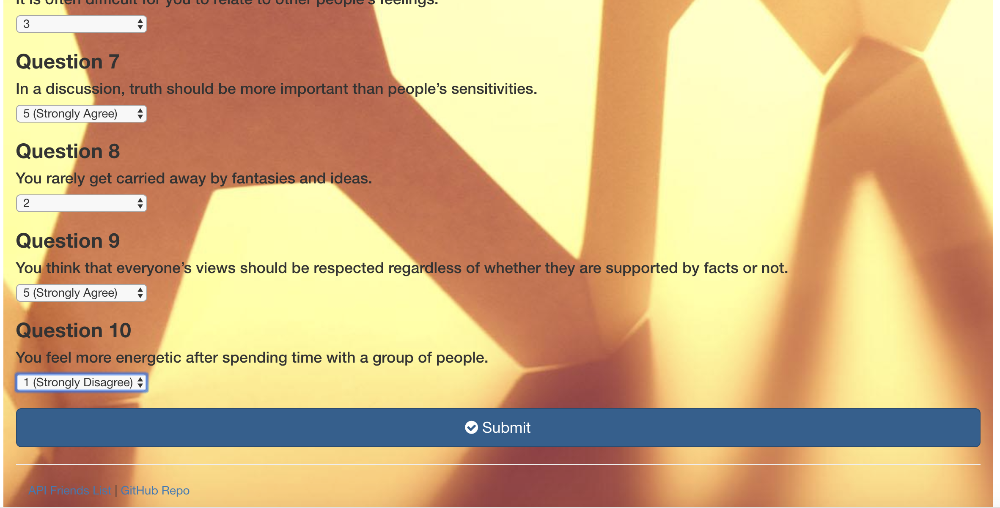

# FriendFinder
FF is a friend matching app, based on users responses to a servey. When the survey is submitted, an existing user record closest to the current user's responses is found and returned. The closest set of user responses is defined as the set with the lowest absolute difference for all ten questions combined.

# Technologies Used

- HTML
- Pug JS(Jade)
- Javascript
- Express
- Node
- JSON
- CSS
# Demo
Please follow the link to Heroku deployment to see the demo of the project.

# Screenshots Walkthrough
 
 
 
 
